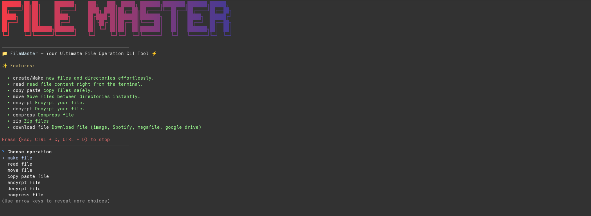

# 📁 File-master

**File-master** is a simple yet powerful **CLI application** to help you manage your files efficiently — directly from the terminal.

---

## ⚙️ Installation

```bash
# Clone the repository
git clone https://github.com/yourusername/File-master.git

# Navigate to project directory
cd File-master

# Install dependecies
npm install .

# Symlink the app to work on any directories
sudo npm link

# Run it
filemaster

